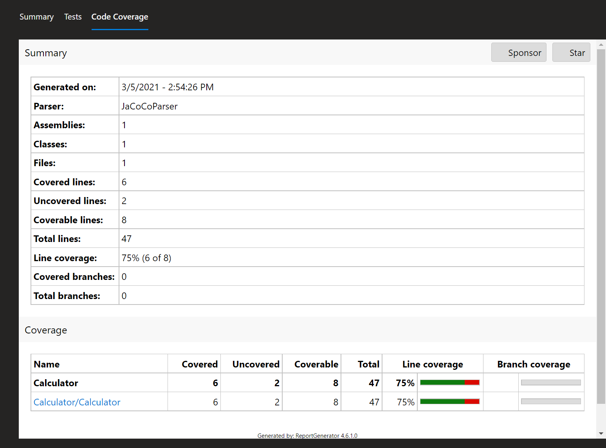
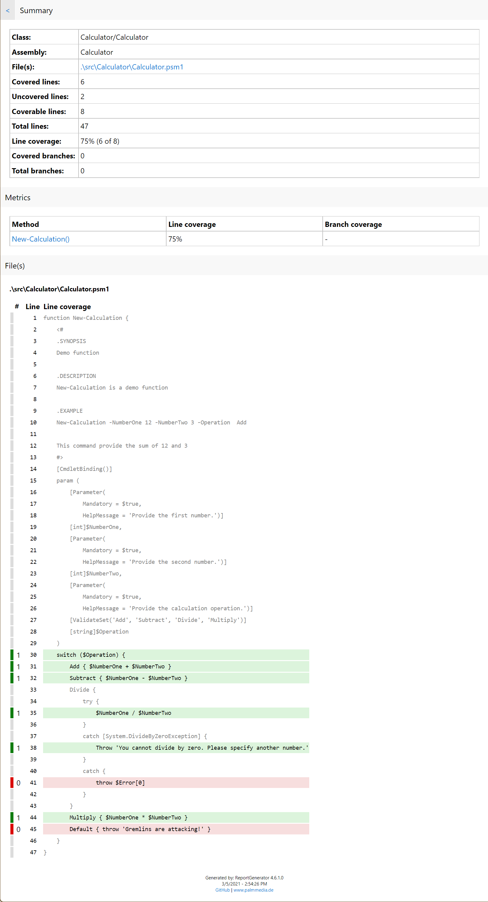

# Marc013Stuff

PowerShell module with all kinds of miscellaneous goodies

## Functions

### **New-CodeCoverageReport**

  Use this function to create a code coverage report using _Pester 5_ and _ReportGenerator_.

- PowerShell module [Pester][2]
- Daniel Palme's [ReportGenerator][3]
    - Download the latest [release][4]
    - Requires [.NET Runtime][5]

      ```PowerShell
      winget install Microsoft.DotNet.Runtime.9
      ```

After downloading the latest release of the _ReportGenerator_ unzip the file. Depending on the version you downloaded you will get the following directory structure:

```text
REPORTGENERATOR_5.4.3
├───net47
├───net8.0
└───net9.0
```

Create directory `C:\ReportGenerator` and copy the content of any of the _netxx_ directory (depending on the .Net Runtime version you have on your system).

Add `C:\ReportGenerator` to environment variable `Path`.

**Example report**

> _Code coverage summary:_
> 
> 
> 
> _Code coverage details:_
> 
> 

### **Set-DirectoryStructure**

  This function creates or updates the directory structure specified in the JSON directory structure template file or object.

  A template example is available [here][1].

[1]: https://github.com/Marc013/Marc013Stuff/blob/main/Example/ExampleDirectoryStructure.json
[2]: https://www.powershellgallery.com/packages/Pester
[3]: https://danielpalme.github.io/ReportGenerator/
[4]: https://github.com/danielpalme/ReportGenerator/releases
[5]: https://dotnet.microsoft.com/en-us/download/dotnet
